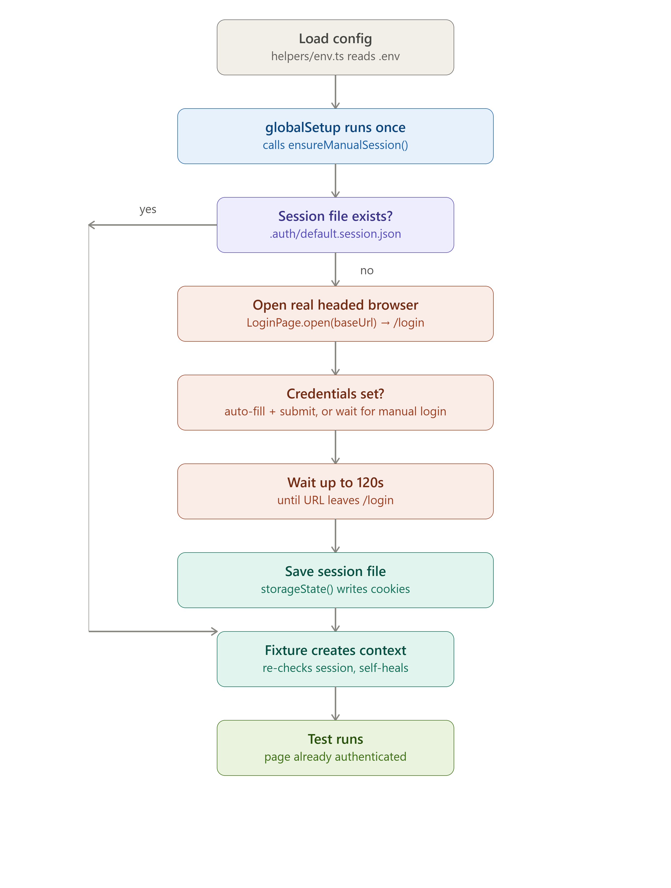

# playwright-session-kit

A reusable Playwright + TypeScript setup whose whole job is **session management**:
log in once by hand, save the browser session to disk, and reuse it across
every test run and every test file - instead of every test (or every run)
re-doing a UI login.

Clone this repo into any project, point it at your app, and go.



## What it gives you

- **One manual login, ever (until you delete it).** A `globalSetup` hook opens
  a real, visible browser the first time there's no saved session, you log in
  by hand, and it saves Playwright's `storageState` (cookies + localStorage) to
  `.auth/<key>.session.json`. Every run after that just reuses the file - no
  re-login, no expiry check, nothing to configure.
- **Login defaults to manual, with an opt-in auto-click.** Set *both*
  `LOGIN_USERNAME` and `LOGIN_PASSWORD` in `.env` and the login form is
  filled in *and submitted* automatically. Leave *either one* unset and
  neither field is pre-filled - you type both in and click login yourself.
  It's all-or-nothing on purpose: pre-filling just one field and leaving the
  other blank would be confusing to log in with by hand.
- **Why manual is the safer default.** Many apps sit behind bot protection
  (Cloudflare Turnstile, etc.) that invalidates a session the moment it's
  reloaded into a browser context that was never actually driven by a human -
  a scripted `fill()`/`click()` login can produce a session that looks fine
  at save time but gets rejected (silently redirected to `/login`) the next
  time it's reused. If your tests start seeing that, unset one of
  `LOGIN_USERNAME`/`LOGIN_PASSWORD` to force the manual (human-click) path,
  which doesn't have this problem.
- **Multiple accounts side by side.** Set `SESSION_KEY` to namespace saved
  sessions (e.g. `admin`, `viewer`) so logging in as a different account
  doesn't clobber another saved session.

## Setup

```bash
npm install
cp .env.example .env
```

Fill in `.env`:

```
BASE_URL=https://your-app.example.com
```

`LOGIN_USERNAME`/`LOGIN_PASSWORD` are optional (see above). Then open
[pages/login.page.ts](pages/login.page.ts) and paste in your app's real
`data-testid` locators for the email/password inputs and submit button -
only needed if you want the pre-fill convenience or plan to write an
automated login-flow test yourself; it's not required for the manual login
step to work.

## Running tests

```bash
npm test              # headless
npm run test:headed   # see the browser
npm run test:ui       # Playwright UI mode
npm run report        # open the last HTML report
```

The first run has no saved session, so a real (non-headless) browser window
opens pointed at `/login`. If both `LOGIN_USERNAME` and `LOGIN_PASSWORD` are
set in `.env`, both fields are typed in and submit is clicked automatically;
if either is missing, both fields are left blank for you to type in and
submit by hand. Once redirected away from `/login`, the session is saved
automatically and the browser closes. Every run after that reuses
`.auth/<key>.session.json` as-is - forever, with no
freshness check. If the app ever rejects it (password changed, session
revoked, etc.), just delete the file and run again to redo the login:

```bash
rm .auth/default.session.json   # or whichever SESSION_KEY you're using
npm test
```

## Using this in your own tests

Import `test`/`expect` from `fixtures/` (not `"@playwright/test"` directly) in
every spec file:

```ts
import { test, expect } from "../../fixtures";

test("dashboard is visible", async ({ page }) => {
  await page.goto("/dashboard");
  await expect(page.getByRole("heading", { name: "Dashboard" })).toBeVisible();
});
```

That's what makes the session **self-healing**: `fixtures/auth.fixture.ts`
overrides Playwright's `context` fixture to check for `.auth/<key>.session.json`
right before each test's context is created - if it's there, it's just a fast
file read; if it's missing (deleted, or `globalSetup` didn't run - some IDE
test runners skip it for a single ad-hoc test), it triggers the manual-login
flow itself instead of throwing `ENOENT`. Importing from `"@playwright/test"`
directly skips this safety net and relies solely on `globalSetup` having run.

## Project layout

```
playwright.config.ts        Playwright config; globalSetup wires up the front-loaded login

pages/                      Page Object Models - one file per major route
  base.page.ts              BasePage extended by all POMs
  login.page.ts             Login form locators - customize this per app

tests/                      Spec files - mirror pages/ structure
  auth/
    login.spec.ts           Example test running with an already-authenticated page

fixtures/                   Reusable test setup - import test/expect from here, not @playwright/test
  index.ts                  Barrel: re-exports test/expect from auth.fixture.ts
  auth.fixture.ts           Overrides `context` for a self-healing session (see above)

helpers/                    Env accessors, global auth setup, session persistence
  env.ts                    Reads .env (BASE_URL required, credentials optional)
  prompt.ts                 Small terminal-prompt helper (askYesNo, used nowhere critical)
  session-manager.ts        sessionFilePath() - where a given SESSION_KEY's file lives
  auth-setup.ts             ensureManualSession() (shared logic) + globalSetup entry point

.auth/                      Saved auth state (gitignored, auto-generated - never commit real sessions)
```

## CI

Manual login obviously doesn't work unheaded on CI. The practical pattern is
to log in once locally, then commit that machine's `.auth/<key>.session.json`
to a private secret store (not the repo - it's gitignored) and have CI
restore it before running tests, refreshing it manually whenever it goes
stale. `BASE_URL` must still be set as a CI secret/variable; it throws a
clear error if missing rather than hanging.

## Why not just log in inside every test?

Because a real UI login is slow, flaky, and - for apps behind bot protection -
often blocked entirely when scripted. Logging in once by hand and sharing the
resulting session across every test file is far more reliable than fighting
an anti-bot system on every run.
